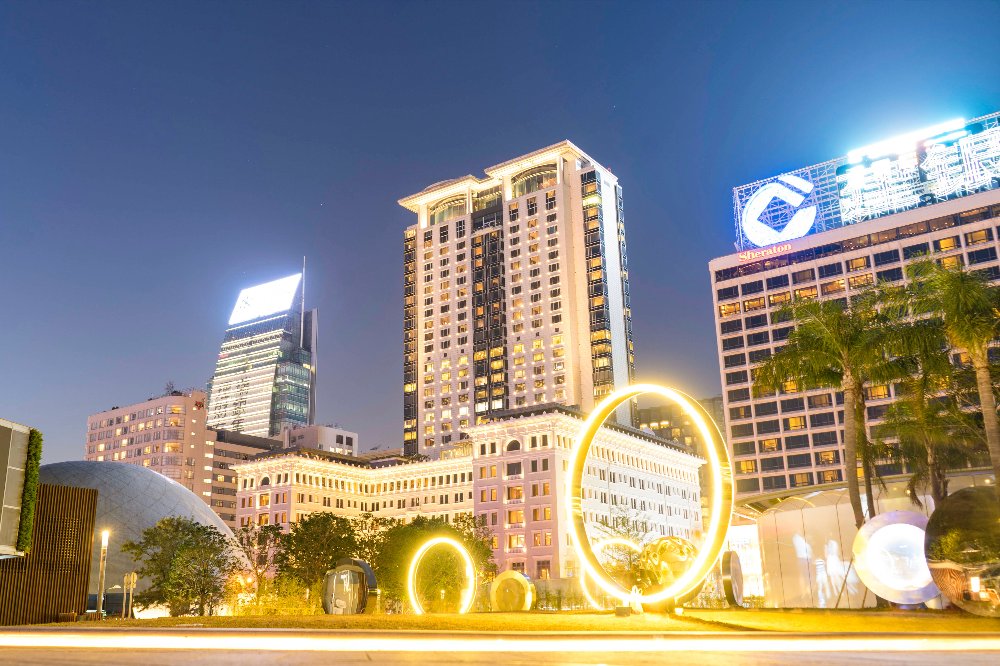

# 🌈 CSS Mastery Hub
## Interactive CSS Properties & Mini Projects Collection

[](https://css3.com)
[](https://html5.com)
[](https://github.com/) 

Welcome to **CSS Mastery Hub**! 🚀 Comprehensive **interactive demos** for CSS properties, selectors, layouts, and **mini projects**. Hands-on learning for all levels.

## 📊 Stats
- **50+ Property Demos** (Core + Backgrounds, Fonts, Transforms...)
- **17 Mini Projects** (Hotel, Netflix, Profiles, Resumes...)
- **Layouts**: Flexbox, Grid, Position, Float
- **Assets**: 13 Images | Fully Responsive | Zero Setup

## ✨ Features
- Interactive hands-on demos
- Self-contained HTML/CSS files
- Organized by CSS topics

## 🔍 Quick Navigation & Search
💡 **Pro Tip**: Use Ctrl+F to search this README for any property/project!

| Category | Key Links |
|----------|-----------|
| 🧱 **Core Properties** | [Box Model](Box_model.html) &#124; [Display](display_property.html) &#124; [Margin/Padding](Margin_property.html) |
| 🎨 **Visual Effects** | [Box Shadow](Box_shadow.html) &#124; [Text Shadow](text_shadow.html) &#124; [Transforms](Transform_property1.html) |
| 📐 **Layouts** | [Flexbox](CSS_layout_Flexbox.html) &#124; [Grid](CSS_layout_grid.html) &#124; [Position](CSS_position/) |
| 🎭 **Selectors** | [Class/ID](css%20selector/) &#124; [Pseudo](css%20selector/Pseudo_class.html) |
| 🔤 **Typography** | [Fonts](font%20property/) &#124; [Text Properties](text_alignment.html) |
| 🌈 **Backgrounds** | [Gradients](Gradient%20property/) &#124; [BG Properties](css%20properties/) |
| 🎯 **Mini Projects** | [Hotel](mini%20projects/hotel_project.html) &#124; [Netflix](mini%20projects/netflix.html) &#124; [All](mini%20projects/)

## 📁 Complete File & Folder Guide
<details>
<summary><b>Root Level Files (Core Properties Demos)</b> 🧱</summary>

| File | Description |
|------|-------------|
| [animation_property.html](animation_property.html) | Demonstrates CSS `@keyframes` and `animation` properties with moving elements. |
| [border_property.html](border_property.html) | Explores `border` styles, width, color for elements. |
| [border_radius.html](border_radius.html) | Shows rounded corners using `border-radius`. |
| [Box_model.html](Box_model.html) | Complete box model explanation: content, padding, border, margin. |
| [Box_shadow.html](Box_shadow.html) | CSS `box-shadow` for drop shadows, glows, 3D effects. |
| [CSS contents](CSS contents) | Overview of CSS linking methods (inline, internal, external). |
| [CSS_layout_Flexbox.html](CSS_layout_Flexbox.html) | Flexbox layout tutorial with alignment examples. |
| [CSS_layout_grid.html](CSS_layout_grid.html) | CSS Grid layout basics and properties. |
| [display_property.html](display_property.html) | `display: block, inline, inline-block, none, flex, grid`. |
| [Float_property.html](Float_property.html) | Legacy `float` for layouts (left/right/clear). |
| [grid_item_allignment.html](grid_item_allignment.html) | Grid item alignment (`justify-items`, `align-items`). |
| [index.html](index.html) | Main index page, likely project overview/home. |
| [inline.html](inline.html) | Inline CSS styling demo (`style` attribute). |
| [internalcss.html](internalcss.html) | Internal CSS using `<style>` tags. |
| [Letter_spacing.html](Letter_spacing.html) | `letter-spacing` for text kerning adjustments. |
| [line_height.html](line_height.html) | `line-height` for vertical text rhythm. |
| [Margin_property.html](Margin_property.html) | `margin` shorthand and individual sides. |
| [media_property.html](media_property.html) | Media queries for responsive design. |
| [outline_property.html](outline_property.html) | `outline` for focus rings, similar to border. |
| [outline_offset.html](outline_offset.html) | `outline-offset` spacing from element edge. |
| [OverFlow_property.html](OverFlow_property.html) | `overflow: hidden, scroll, auto, visible`. |
| [Padding_property.html](Padding_property.html) | `padding` inner spacing shorthand/properties. |
| [style.css](style.css) | Shared external stylesheet for multiple pages. |
| [text_alignment.html](text_alignment.html) | `text-align: left, center, right, justify`. |
| [Text_decoration.html](Text_decoration.html) | `text-decoration` underline, line-through. |
| [Text_indent.html](Text_indent.html) | `text-indent` for first line indentation. |
| [text_shadow.html](text_shadow.html) | `text-shadow` for glowing/drop shadow text. |
| [Text_transform.html](Text_transform.html) | `text-transform: uppercase, lowercase, capitalize`. |
| [textandbox_shadow.html](textandbox_shadow.html) | Combined text and box shadow effects. |
| [Transform_property1.html](Transform_property1.html) | 2D transforms: rotate, scale, skew, translate. |
| [Transform_property2.html](Transform_property2.html) | Advanced 3D transforms and perspective. |
| [Transition_property.html](Transition_property.html) | Smooth `transition` on hover/state changes. |
| [visibility_property.html](visibility_property.html) | `visibility: hidden, visible, collapse`. |
| [word_spacing.html](word_spacing.html) | `word-spacing` for tracking between words. |

</details>

<details>
<summary><b>📂 Box sizing/</b> (Box Model Variants)</summary>

| File | Description |
|------|-------------|
| [border_box.html](Box%20sizing/border_box.html) | `box-sizing: border-box` – total width includes padding/border. |
| [content_box.html](Box%20sizing/content_box.html) | `box-sizing: content-box` – default, width excludes padding/border. |

</details>

<details>
<summary><b>📂 css properties/</b> (Background & Color Demos)</summary>

| File | Description |
|------|-------------|
| [bg_attachment.html](css%20properties/bg_attachment.html) | `background-attachment: scroll, fixed, local`. |
| [bg_color.html](css%20properties/bg_color.html) | `background-color` with colors, rgba, hsla. |
| [bg_image.html](css%20properties/bg_image.html) | `background-image` using images/gradients. |
| [bg_position.html](css%20properties/bg_position.html) | `background-position` alignment/control. |
| [bg_repeat.html](css%20properties/bg_repeat.html) | `background-repeat: repeat, no-repeat, space`. |
| [bg_size.html](css%20properties/bg_size.html) | `background-size: cover, contain, length`. |
| [color_property.html](css%20properties/color_property.html) | Text `color` properties and named/hex values. |

</details>

<details>
<summary><b>📂 css selector/</b> (Selector Types)</summary>

| File | Description |
|------|-------------|
| [attribute_selector.html](css%20selector/attribute_selector.html) | `[attr], [attr=value]` attribute selectors. |
| [class_selector.html](css%20selector/class_selector.html) | `.class` class selectors. |
| [Descendant_selector.html](css%20selector/Descendant_selector.html) | Space-separated descendant selectors. |
| [element_selector.html](css%20selector/element_selector.html) | Tag name selectors (div, p, h1). |
| [grouping_selector.html](css%20selector/grouping_selector.html) | Comma-separated grouped selectors. |
| [ID_selector.html](css%20selector/ID_selector.html) | `#id` unique ID selectors. |
| [Pseudo_class.html](css%20selector/Pseudo_class.html) | `:hover, :active, :nth-child` pseudo-classes. |
| [universal_selector.html](css%20selector/universal_selector.html) | `*` universal selector for all elements. |
| rooms.jpg | Sample image used in selector demos. |

</details>

<details>
<summary><b>📂 CSS_position/</b> (Position Values)</summary>

| File | Description |
|------|-------------|
| [CSS_position_property1.html](CSS_position/CSS_position_property1.html) | `position: static` (default). |
| [CSS_position_property2.html](CSS_position/CSS_position_property2.html) | `position: relative` with offset. |
| [CSS_position_property3.html](CSS_position/CSS_position_property3.html) | `position: absolute` relative to parent. |
| [CSS_position_property4.html](CSS_position/CSS_position_property4.html) | `position: fixed` viewport-based. |
| [CSS_position_property5.html](CSS_position/CSS_position_property5.html) | `position: sticky` hybrid scroll behavior. |

</details>

<details>
<summary><b>📂 font property/</b> (Typography Suite)</summary>

| File | Description |
|------|-------------|
| [font_color.html](font%20property/font_color.html) | Font `color` application. |
| [font_family.html](font%20property/font_family.html) | `font-family` web-safe and custom fonts. |
| [font_size.html](font%20property/font_size.html) | `font-size` px/em/rem/keywords. |
[font_style.html](font%20property/font_style.html) | `font-style: italic, oblique, normal`.
[font_variantandweight.html](font%20property/font_variantandweight.html) | `font-weight` (bold), `font-variant` (small-caps).

</details>

<details>
<summary><b>📂 Gradient property/</b></summary>

| File | Description |
|------|-------------|
| [conic_gradient.html](Gradient%20property/conic_gradient.html) | Conic gradients from center point. |
| [Linear_gradient.html](Gradient%20property/Linear_gradient.html) | Linear gradients with angles/stops. |
| [Radial_gradient.html](Gradient%20property/Radial_gradient.html) | Radial/elliptical gradients. |

</details>

<details>
<summary><b>🖼️ images/ (Assets)</b></summary>

Contains 12 images: arrow.jpg, burger.jpg, cs.jpeg.jpeg, dhee.jpg, dining.jpg, heroimg.jpg, menu-bar.jpg, phoenix-logo.png, pool.jpg, rooms.jpg, stage.jpg, street.jpg, table.jpg. Used in demos/projects for backgrounds/heroes.

</details>

<details>
<summary><b>🎯 mini projects/ (Practical Examples)</b></summary>

| File | Description |
|------|-------------|
| [grid_project1.html](mini%20projects/grid_project1.html) | Simple CSS Grid layout project. |
| [grid_project2.html](mini%20projects/grid_project2.html) | Advanced Grid showcase. |
| [hotel_project.html](mini%20projects/hotel_project.html) | Full hotel landing page with images/sections. |
| [loginpage.html](mini%20projects/loginpage.html) | Responsive login form. |
| [miniproject1.html](mini%20projects/miniproject1.html) - [miniproject6.html](mini%20projects/miniproject6.html) | Series of small CSS practice projects (cards, buttons, etc.). |
| [netflix.html](mini%20projects/netflix.html) | Netflix-style landing with grid/carousel. |
| [Product_landing.html](mini%20projects/Product_landing.html) | Product page with hero, features. |
| [Profile_card.html](mini%20projects/Profile_card.html) | Hoverable profile card demo. |
| [profile.html](mini%20projects/profile.html) | User profile page layout. |
| [resumemaking.html](mini%20projects/resumemaking.html) | Resume/CV template with sections. |
| [tables.html](mini%20projects/tables.html) | Styled data tables. |
[visiting_card.html](mini%20projects/visiting_card.html) | Visiting/business card design. 🎴

</details>

## 🚀 Quick Start
1. Clone/Download this repo
2. Double-click any `.html` file to open in browser 🎉
3. **No setup needed** – all files are self-contained!

**Commands** (Windows):
```bash
# Open main index
start index.html

# List all demos
dir *.html

# Open folder in Explorer
explorer .

# Open all mini projects folder
start "Mini Projects" "mini projects"
```


## 🤝 Contributing
1. Fork the repo
2. Add new CSS demos/projects in relevant folders
3. Update README tables with your additions
4. Submit PR with description of changes 🎉

**License**: MIT License – Free to use/modify/share!

⭐ **Star if helpful! Found a bug? Open an issue!**



**Updated by BLACKBOXAI**

